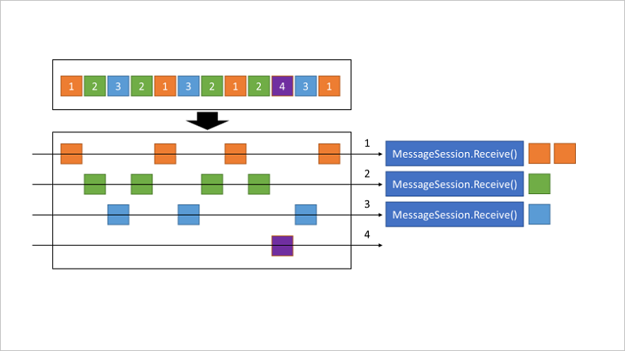
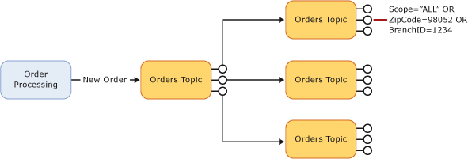
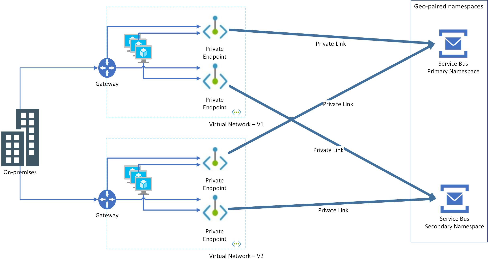

# TOC
- [Messaging on Azure](#Messaging-on-Azure)
- [Service Bus Overview](#Service-Bus-Overview)
	- [Tiers](#Tiers)
	- [Queues, Topics and Subscriptions](#Queues,-Topics-and-Subscriptions)
	- [Authentication and Authorization](#Authentication-and-Authorization) 
	- [Data Encryption](#Data-Encryption)
	- [Advanced Capabilities](#Advanced-Capabilities)
	- [SDKs and Protocols](#SDKs-and-Protocols)	
	- [Networking](#Networking)
	- [HA and DR](#HA-and-DR)
		- [HA](#HA)
		- [DR](#DR)  
- [Demo](#Demo)

# Messaging on Azure
- [Azure Event Grid](https://docs.microsoft.com/en-us/azure/event-grid/)
	- Used to facilitate messaging in event based architectures.
	- Pub / Sub architecture geared towards delivery of very light weight events. 
	- Events indicate a change of condition or state change that would inform some downstream action. 
	- Used pervasively on Azure for integration between services.
- [Azure Event Hubs](https://azure.microsoft.com/en-us/services/event-hubs/)
	- Build for at scale data streaming scenarios.
	- Think low latency ingestion of events at a rate of millions of events per second.
- [Azure Storage Queues](https://docs.microsoft.com/en-us/azure/storage/queues/storage-queues-introduction)
	- Exposed as part of an Azure Storage Account.
	- Low cost.
	- Benefits from all of Azure Storage's features (data encryption, networking integration, auth, etc.)
	- Multiple Queues can be created in a single account.
	- Simple queuing functionality with no [advanced features](#Advanced-Capabilities). E.G. cannot support long polling, FIFO, duplicate detection, sessions, etc.
	- Full compare and contrast [here](https://docs.microsoft.com/en-us/azure/service-bus-messaging/service-bus-azure-and-service-bus-queues-compared-contrasted).
- [Azure Service Bus](https://docs.microsoft.com/en-us/azure/service-bus-messaging/)
	- Primary enterprise messaging service  
	- used for messaging, decoupling applications, pub / sub scenarios where the message is generally of high value.
	- Supports many advanced features

# Service Bus Overview
- With Service Bus, everything starts w/ creation of a Service Bus **Namespace**. Namespaces are the top level containers that hold other messaging entities (queues, topics, subscriptions).  

- A namespace is a resource that gets deployed to a resource group in Azure with the following characteristics:
	- **Name:**  
This is globally unique. A DNS name (*.servicebus.windows.net)  

	- **Location:**  
Region  

	- **Pricing Tier:**  
Either Basic Standard or Premium.  

## Queues, Topics and Subscriptions
- Service Bus Queues:
	- Used for point-to-point communication (competing consumers).
	- Messages in queues are ordered and timestamped on arrival.
	- Once accepted, the message is held safely in redundant storage.
 Messages are delivered in pull mode, only delivering messages when requested.

- Service Bus Topics:
	- Used for publish/subscribe scenarios.
	- A topic will have one or more named **subscriptions**.
	- When messages are sent to a topic, the subscriptions that they land in can be controlled by configuring subscription based [filters/rules](https://docs.microsoft.com/en-us/azure/service-bus-messaging/service-bus-queues-topics-subscriptions#rules-and-actions).
  

## Tiers
- **Premium:** (recommended)
	- Supports queues, scheduled messages, topics, transactions, de-duplication, sessions, forwarding.
	- Limited to 1MB message size
	- Up to 80GB Queue / Topic Size
	- CPU and memory isolation which equates to predictable and consistent performance (messaging unit).
	- Scale from 1-8 "messaging units" (MU).
	- An MU is essentially a dedicate VM.
	- The number of MUs you scale to should be based on observed load (CPU).
	- Scaling can be automated using Azure Automation. No autoscale built into the service itself.
	- Limited to 1000 connections (per MU) 
	- **Required** for virtual network integration features like services endpoints and private link.  
	- Recommended for all production use cases.
	- [Great article](https://techcommunity.microsoft.com/t5/service-bus-blog/premium-messaging-how-fast-is-it/ba-p/370722) (although a bit dated) on premium performance. Code is [here](https://github.com/Azure-Samples/service-bus-dotnet-messaging-performance/tree/master/ThroughputTest) if you are inclined to re-run the tests.
	- [**Pricing**](https://azure.microsoft.com/en-us/pricing/details/service-bus/) for premium is linear based on the number of MUs running per hour.  

- **Standard:**
	- Supports queues, scheduled messages, topics, transactions, de-duplication, sessions, forwarding.
	- Limited to 256k message size
	- Limited to 1000 connections w/ ability to burst over for a cost.
	- no resource isolation
	- no geo-disaster recovery  
	- [**Pricing**](https://azure.microsoft.com/en-us/pricing/details/service-bus/) is a base charge + by the operation

- **Basic:**
	- Supports queues and schedules messages
	- Does not support topics, transactions, de-duplication, sessions, forwarding/
	- Limited to 256k message size
	- Limited to 100 connections
	- no resource isolation
	- no geo-disaster recovery
	- [**Pricing**](https://azure.microsoft.com/en-us/pricing/details/service-bus/) is by the operation

## Authentication and Authorization
- [Azure AD](https://docs.microsoft.com/en-us/azure/service-bus-messaging/authenticate-application) (recommended)
	- Using Azure RBAC, access can be granted at the containing mgmt. group, subscription, resource group, namespace or queue/topic/subscription. use the narrowest scope.
	- built in roles exist for [data owner](https://docs.microsoft.com/en-us/azure/role-based-access-control/built-in-roles#azure-service-bus-data-owner), [data sender](https://docs.microsoft.com/en-us/azure/role-based-access-control/built-in-roles#azure-service-bus-data-sender) and [data receiver](https://docs.microsoft.com/en-us/azure/role-based-access-control/built-in-roles#azure-service-bus-data-receiver)
	- Access can be granted to any AAD principal, user, group, service principal, managed identity, etc. 
	- If accessing an entity from code running within Azure use of [managed identity](https://docs.microsoft.com/en-us/azure/service-bus-messaging/service-bus-managed-service-identity) is encouraged.

- [Shared access signature](https://docs.microsoft.com/en-us/azure/service-bus-messaging/service-bus-sas)
	- Java example [here](https://github.com/Azure/azure-service-bus/tree/master/samples/Java/azure-servicebus/SasAuthorization).
	- Shared Access Authorization Policies can be configured at the namespace and entity level.
	- Rights can be configured on the policy rules that are a combination of Send, Listen and Manage (inclusive of Send and Listen).
	- Each rule has a primary and secondary key (secret)
	- By default there is a policy rule called RootManagedSharedAccessKey on the namespace at creation. It's recommended not to use this. 
	- If a caller has access to the keys associated with a policy, they can derive a SAS token that can be used to interact w/ the namespace or entity.
	- These SAS tokens are similar in concept to those used on Azure Storage Accounts.
## Data Encryption
- Data in the messaging store is automatically encrypted at rest (AES 256) using a Microsoft managed encryption key. This cannot be turned off.
- It's possible to encrypt using a [customer managed key](https://docs.microsoft.com/en-us/azure/service-bus-messaging/configure-customer-managed-key) stored in Azure Key Vault.
- Data is encrypted in flight using TLS. It's not possible to establish an unencrypted AMQP session to Service Bus. See [this article](https://docs.microsoft.com/en-us/azure/service-bus-messaging/service-bus-amqp-protocol-guide#connections-and-sessions) for details on the AMQP TLS implementation for Service Bus.
	
## Advanced Capabilities
- **[Message Sessions](https://docs.microsoft.com/en-us/azure/service-bus-messaging/message-sessions)**
	- 
	- Gives you a way of designating a relationship between messages using a SessionID.
	- When a session is created by the client on recieve, a lock is obtained on all messages with that sessions SessionID. Messages for that session are only dispatched to that client.
	- Gives you a way of having a set of related messages processed by a single receiver.
	- Needs to be enabled at the queue level.
	- Has to be enabled before a session can be used in the API.
	- Once enabled, Session ID (app designated) must be specified when submitting messages to a topic or queue.
	- [Java SDK example](https://github.com/Azure/azure-sdk-for-java/blob/master/sdk/servicebus/azure-messaging-servicebus/src/samples/java/com/azure/messaging/servicebus/SendAndReceiveSessionMessageSample.java)
	- Generally used in "first in, first out" and "request-response" patterns.
		- **first in, first out:** Send a string of related messages. All messages in the string use the same SessionID. Label property used to indicate start, content and end messages. SequenceNumber used to order content offset from start.
		- **request-response:** Use a single queue for targeted send and receive operations. E.G. Sender A sends message with unique ID for SessionID. Receiver A picks up message, processes and replies on same session ID. Sender A picks up reply.
	
	
	Three clients. Each with a session (1,2,3). Each client pulls only that sessions messages. 
  
- [**Autoforwarding**](https://docs.microsoft.com/en-us/azure/service-bus-messaging/service-bus-auto-forwarding)
	- Java examples [here](https://github.com/Azure/azure-service-bus/tree/master/samples/Java/azure-servicebus/AutoForward).
	- Automatically remove messages placed in one queue or subscription and put them in a second queue (or topic).
	- Enabled via code on a per-queue or subscription basis.
	- Target needs to be in the same namespace.
	- Use to scale out topics as subscriptions on a given topic are limited to 2000:
	
	- Use to decouple senders and receivers
	- In below example a set of subscription is set up to forward a subset of messages sent to a topic into downstream queues for processing. This prevents the topics from hitting quota.
	
  
- [**Dead-letter queue**](https://docs.microsoft.com/en-us/azure/service-bus-messaging/service-bus-dead-letter-queues)
	- Secondary sub-queue for queues and topic subscriptions.
	- auto created and cannot be removed.
	- Designed to hold messages that cannot be delivered or processed.
	- Not automatically cleaned up.
	- The messaging engine [may place messages in this queue](https://docs.microsoft.com/en-us/azure/service-bus-messaging/service-bus-dead-letter-queues#moving-messages-to-the-dlq) (exceding TTL, hitting max delivery attempts, etc.). Your app may explicitly do so as well.

- [**Scheduled delivery**](https://docs.microsoft.com/en-us/azure/service-bus-messaging/message-sequencing#scheduled-messages)
	- Submit messages to a topic or queue for delayed processing.
	- Messages will not show in until the scheduled time.
	- Schedule messages either by setting a property on the message or explicitly calling the scheduleMessageAsync API.
  
- [**Message deferral**](https://docs.microsoft.com/en-us/azure/service-bus-messaging/message-deferral)
	- Allows a client to defer processing of a message that it is willing to process.
	- Message stays safely in the messaging store but cannot be read unless explicitly retrieved (presumably by the original receiver) by sequence number.  

- [**Batching** ](https://docs.microsoft.com/en-us/azure/service-bus-messaging/service-bus-performance-improvements?tabs=net-standard-sdk#client-side-batching)
	- Delay sending of a message to a queue or topic until a threshold is hit (time based). After which all messages in the windows are sent as a single batch.
	- Can be used to improve overall throughput by reducing transactions.
	- Client side batching is a function of the SDK being used to send messages.
	- We also batch our writes to the underlying messaging store. This happens transparently.  

- [**Transactions**](https://docs.microsoft.com/en-us/azure/service-bus-messaging/service-bus-transactions)
	- Service Bus is at its core a transactional message broker. E.G. if it accepts a message it has already been stored and labeled w/ a sequence number.
	- It's also possible to group your operations within the scope of a transaction so that all operations must succeed for the transaction to be committed to the entity.

- [**Filtering and Actions**](https://docs.microsoft.com/en-us/azure/service-bus-messaging/topic-filters)
	- Java examples [here](https://github.com/Azure/azure-service-bus/tree/master/samples/Java/azure-servicebus/TopicFilters).
	- Applies only to topic subscriptions.
	- Used to partition messages into multiple subscriptions or to route messages to specific subscriptions.
	- Filters are specified via topic subscription rules. Rules can contain conditions as follows:
		- Boolean
		- SQL
		- Correlation (recommended over SQL)
	- Filters evaluate message properties **not** the message body. The message body in binary.
	- Can negatively impact throughput (specifically SQL based filters).
	- Actions on SQL filters allow you to update message properties.

- [**Auto-delete on idle**](https://docs.microsoft.com/en-us/dotnet/api/microsoft.servicebus.messaging.queuedescription.autodeleteonidle?view=azure-dotnet)
	- Delete a queue if the queue is idle for a set duration. Minimum duration is 5 minutes.  

- [**Duplicate detection**](https://docs.microsoft.com/en-us/azure/service-bus-messaging/duplicate-detection)
	- If a client sends the same message multiple times Service Bus will discard the duplicates.
	- Duplicate detection is based off of MessageID which is set by the application.
	- Enabled on a queue or topic. Off by default.
	- Must be enabled at queue creation time.
	- Can negatively impact throughput  

## SDKs and Protocols
### SDKs
- [.NET](https://docs.microsoft.com/en-us/dotnet/api/microsoft.servicebus.messaging?view=azure-dotnet)
- [Java](https://docs.microsoft.com/en-us/java/api/overview/azure/servicebus?view=azure-java-stable)
- JMS ([Qpid JMS](https://qpid.apache.org/components/jms/)) - keep in mind that the [certain JMS features are limited](https://docs.microsoft.com/en-us/azure/service-bus-messaging/service-bus-java-how-to-use-jms-api-amqp#unsupported-features-and-restrictions). Primarily those that relate to dynamic entity management.  
- Python
- Node.js
- PHP
- Ruby
- Go
- PowerShell
- REST
### Protocols
- [AMQP](https://docs.microsoft.com/en-us/azure/service-bus-messaging/service-bus-amqp-overview) (default and recommended)
- SMBP (legacy)

## Networking
- Service bus namespaces are by default available on public endpoints.
- Service Bus supports both [Service Endpoints](https://docs.microsoft.com/en-us/azure/service-bus-messaging/service-bus-service-endpoints) and [Private Link](https://docs.microsoft.com/en-us/azure/service-bus-messaging/private-link-service) for integration into private networks.
- Service Bus, similar to many other Azure services, supports a [per-instance firewall](https://docs.microsoft.com/en-us/azure/service-bus-messaging/service-bus-ip-filtering) that can be used to restrict traffic to known networks.
- Depending on the client and protocol being used the following ports are required for connectivity
	- AMQP (5671)
	- SMBP (9354)
	- HTTPS (443)
- Keep in mind that if using service endpoints, you must [accommodate for connectivity in HA/DR scenarios](https://docs.microsoft.com/en-us/azure/service-bus-messaging/service-bus-geo-dr#recommended-configuration).  

Each region has one private endpoint per regional namespace.

## HA and DR
The [documented SLA](https://azure.microsoft.com/en-us/support/legal/sla/service-bus/v1_1/) for Service Bus irrespective of configuration is 99.9%.
### HA
- [Availability zones](https://docs.microsoft.com/en-us/azure/service-bus-messaging/service-bus-outages-disasters#availability-zones) are supported only with Service Bus Premium SKU and must be enabled at creation time. This spreads the namespace across three distinct zones in [regions that support them](https://docs.microsoft.com/en-us/azure/availability-zones/az-region#:~:text=Table%201%20%20%20%20%20%20,%20%20%E2%9C%93%20%2025%20more%20rows%20). Both East US 2 and Central US support zones.
- Three copies of messaging store (1 primary and 2 secondary) are maintained across zones. Service Bus keeps all the three copies in sync for data and management operations. If the primary copy fails, one of the secondary copies is promoted to primary with no perceived downtime.  

### DR
- Service Bus Premium SKU supports [Geo-Disaster Recovery](https://docs.microsoft.com/en-us/azure/service-bus-messaging/service-bus-geo-dr).
- Two namespaces in different regions can be paired together in a primary / secondary relationship.
- When paired, all entity **metadata** is replicated between primary and secondary namespaces (includes access policies).
- The message store data itself is **NOT** replicated. E.G. not only messages but also sessions, duplicate detection and scheduled messages.
- The primary / secondary namespaces are fronted by an alias that can be used by connecting clients. This alias will point at the current primary namespace. This is quite literally a DNS CNAME. Example:
	```
	namespacekskalias.servicebus.windows.net. 9 IN CNAME namespace1ksk.servicebus.windows.net.
	namespace1ksk.servicebus.windows.net. 9 IN CNAME ns-sb2-prod-bn3-az402.trafficmanager.net.
	ns-sb2-prod-bn3-az402.trafficmanager.net. 299 IN CNAME ns-sb2-prod-bn3-az402-s2.cloudapp.net.
	ns-sb2-prod-bn3-az402-s2.cloudapp.net. 9 IN A   52.167.106.66
	```
- Failover is manual (unless the customer automates). When failover is initiated, the alias is re-pointed to the secondary namespace and the geo-replication relationship is broken. 
- Post failover, a new geo-replication relationship must be formed if desired.
- See [the following](https://docs.microsoft.com/en-us/azure/azure-functions/functions-geo-disaster-recovery#activepassive-for-non-https-functions) for guidance on how to handle DR when using functions in concert with geo-redundant Service Bus implementations.


# Demo

## **Make sure Pre-Reqs are present:**
- Windows Subsystem for Linux with:
	- Azure CLI (authenticated w/ correct subscription selected)
	- Maven
	- openjdk 11
- This repo cloned locally

## Deploy Resources:**
Run the [deployment script](ARM/deploy.sh).
```
 cd ARM
 ./deploy.sh
```
This will call three ARM templates. One for [namespaces](ARM/azuredeploy-namespace.json), one for [entities](ARM/azuredeploy-queuestopics.json) and one to set up [geo-redundant pairing and an alias](ARM/azuredeploy-georeplication.json).  
You will likely need to change the namespace names for uniqueness (lines 8-9).

## **Walk Through Deployed Namespaces in Portal:**
- SKU
- Zone Redundancy
- Messaging Units (scaling)
- Diagnostic Logging Config *(OperationalLogs and AllMetrics)*
- Encryption
- RBAC Config
- **Generate SAS for queue1**. This will be used in client demo.
- Geo-Recovery, Alias, Primary and Secondary Namespaces  

## **Build and Run a Simple Java Client:**
- Quick walk-through of [code](test/src/main/java/test/SendAndReceiveSessionMessageSample.java)
- Add connection string to code.  
Use the connection string associated w/ the SAS created in the above portal walk-through.
- Maven Build  
 	```
	 cd test
	 mvn clean
	 mvn compile
	 mvn package
	 java -jar target/SendAndReceiveSessionMessageSample-0.1.0.jar
  	```

- Run the app (takes one argument of a sessionID):
    ```
	 java -jar target/SendAndReceiveSessionMessageSample-0.1.0.jar sessionID
  	```
- The app will:
	- Send to a queue asynchronously using batch and sessions.
	- Pause
	- Read from queue async
- Run two instances of the app simultaneously with two different session ID's. Notice that each instance of the app will only send and receive messages on it's own session.
- Conduct manual geo-failover and verify the app continues to function on the secondary (now primary) namespace.
- Use [Service Bus Explorer](https://github.com/paolosalvatori/ServiceBusExplorer#:~:text=The%20Service%20Bus%20Explorer%20allows%20users%20to%20connect,and%20administer%20messaging%20entities%20in%20an%20easy%20manner.) in the portal to explore queue content while testing. Please note that service bus explorer in the portal will not show messages in a queue with sessions enabled.
